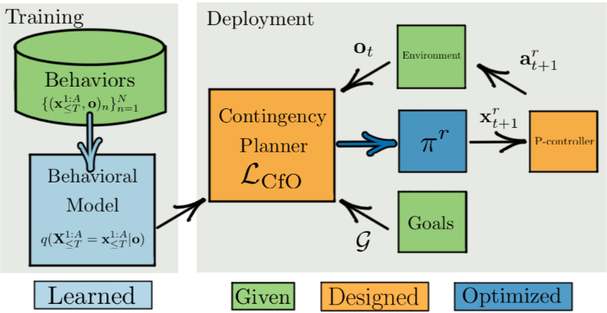

# Contingencies from Observations: Tractable Contingency Planning with Learned Behavior Models

Nicholas Rhinehart∗, Jeff He∗, Charles Packer, Matthew A. Wright, Rowan McAllister, Joseph E. Gonzalez, Sergey Levine
UC Berkeley

ICRA 2021

## Introduction
기존 연구들은 다른 agent의 행동을 예측하는 모델을 먼저 만들고 이를 이용해 plan를 설계한다.
하지만 이 방법은 로봇의 행동과 환경 간의 상호의존성을 추정할 수 없다.
로봇의 행동으로 인해 주변 agent이 어떻게 행동할 것인지, 주변 agent에 따라 로봇의 행동이 어떻게 달리지는지 고려하지 못한다.

따라서 주변 차량의 의도에 대한 불확실성을 알기 위해서는 관련 정보를 찾아야한다.
그래서 일부러 로봇에 의도를 보여줌으로서 그에 대한 주변 차량의 행동을 보고 의도를 파악하고 행동한다.
주변 차량에게 의존적인 계획도 세우면서, 주변 차량이 로봇에게 의존적이게도 모델링 해야한다.

## Related work
**Learned behavior model, noncontingent planning**
최근 fully learned planning 접근 방식은 동역학 모델링하여 보상 함수를 통해 계획를 세우는 방식이지만 다른 주변 차량의 행동을 표현하지 못한다.
(동역학 모델 : 어떻게 움직이는가? / 행동 모델 : 행동의 의도)
그래서 특정 상황에서의 조건에 대비한 행동을 하지 못한다.

모듈 접근 방식은 예측에 따라 plan이 바뀌는 조건에 대비하는 행동을 할 수 있지만 모듈 간의 표현에 크게 의존한다.

**Passive contingency planning**
수동적으로 계획하는 것으로 로봇의 행동이 주변 차량에 영향을 주는 것을 모델링하지 않고 주변 차량에 의존하여 계획하는 구조이다.
이에 따라 로봇이 주변의 행동의 불확실성으로 인해 소극적인 행동을 취하게 된다.

**Model-free method**
모델이 contingency plan을 암묵적으로 표현하는 것으로 모방 학습이나 강화 학습으로 정책을 구축하였다.
하지만 이러한 방법은 학습 데이터 분포와 테스트 데이터 분포가 작아야 성공적이다.

## DEEP CONTINGENCY PLANNING

#### Model Design and Training Details
\[
q_\theta(\mathbf{X}_{\leq T}^{1:A} = \mathbf{x}_{\leq T}^{1:A} | \mathbf{o}) = \prod_{t=1}^{T} \prod_{a=1}^{A} q^a(\mathbf{X}_t^a = \mathbf{x}_t^a; \phi_t^a),
\]
$\phi^a_t = f^a_\theta(\mathbf{x}_{1:A}^{<t},\,o)$
$\mathbf{x}_t^a = m(\mathbf{z}_t^a;\phi_t^a)$
E.g
$q^a = \mathcal{N}( \cdot | {\{\mu_t^a,\sigma_t^a\}})$ 이면
$m(\mathbf{z}_t^a;\phi_t^a) = \mu_t^a + \sigma_t^a\mathbf{z}_t^a$이고
$\bar q^a(\mathbf{z}_t^a) = \mathcal{N}(\mathbf{z}_t^a;0,I)$

각 time,agent 별 조건부로 구성되어 이들끼리의 곱들이 전체 공동확률을 나타낸다.
ex) i agent가 t일 때, 그리고 i+1 agent가 t일 때, ...

