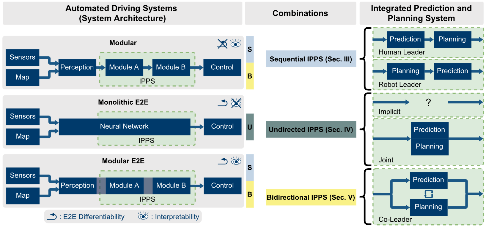
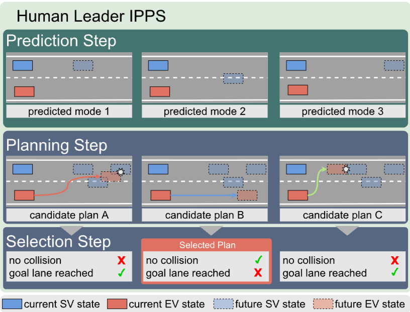
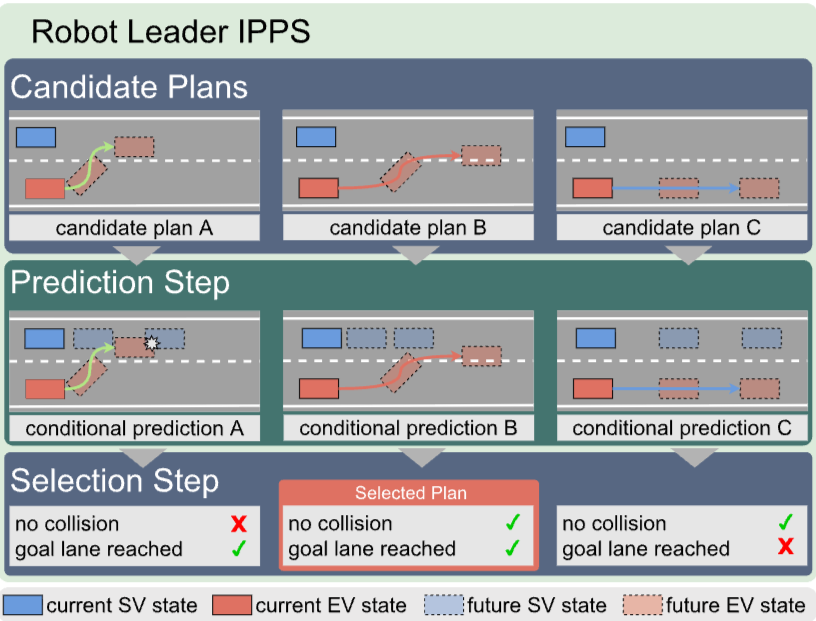
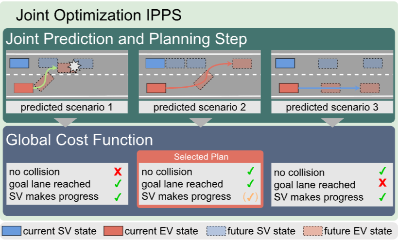
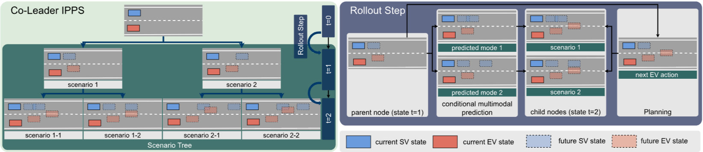

# The Integration of Prediction and Planning in Deep Learning Automated Driving Systems: A Review
IEEE Transactions on Intelligent Vehicles 2025

## 기존 연구
이 논문에서는 자율 주행 시스템을 다음과 같은 세 가지 범주로 나누었다.

통합 예측 및 계획 시스템(Integrated Prediction and Planning System, IPPS)을 세 가지로 나눴다.
- Sequential IPPS
    예측과 계획이 순차적으로 실행되는 방식
- Unidirected IPPS
    예측과 계획이 암시적 또는 공동으로 처리되는 방식
- Bidirectional IPPS
    자율주행과 주변차량 간의 양방향 상호작용을 명시적으로 모델링하는 방식

이 논문에서는 자율주행 시스템에서 모듈형 시스템이 있는데
모듈 방식의 시스템은 예측과 계획이 순차적이기 때문에 자율주행의 계획에 의한 행동이 주변 차량의 반응에 미치는 영향을 고려하지 못한 것을 지적하였다.
그래서 예측과 계획이 통합되는 것을 중요하게 생각한다.

### Contribution
- 예측과 계획 간의 종속성을 기반으로 두 부분의 통합에 대한 분류를 제안한다.
이러한 범주가 시스템 구조, 행동 측면, 안전과 어떻게 관련되는지 조사했다.
- 특히, 모듈식 구조의 예측 및 계획 모듈에서의 설계 선택에 대한 포괄적인 개요를 제공하고
상호작용과 시스템 레벨 동작에 미치는 영향을 논의한다.
- 최신 연구의 격차를 밝히고, 식별된 범주를 기반으로 미래 연구에 유망한 방향을 제시한다.

# Sequential IPPS
## Prediction
### Input Representations
자율주행 차량을 위해서는 agent의 상태 $\bar{X}$와 지도 $I$ 표현이 가장 중요한 정보이다.
크게 두 가지 방식이 있다. Rasterized and Sparse

**Rasterized** 표현은 종종 여러 개의 채널을 가진 dense하고 고정된 해상도의 그리드 구조이다.
일반적으로 HD map, BEV로 표현되어 CNN으로 처리하는데 적합하다.
하지만 모든 부분을 임베딩하는 것은 양자화 오류로 정보 손실을 초래하고 국소적으로 제한된 수용 필드(CNN의 커널 같음)와 CNN의 제한된 해상도는 상호 작용 모델링을 방해할 수도 있다.

**Sparse** 표현은 장면의 모든 객체를 설명한다. 객체별 벡터는 Transformer, GNN으로 상호작용 모델링을 한다.
순차적 신호를 인코딩하기 위해서 1D CNN, LSTM, GRU, Transformer를 사용하고 일부 연구는 rasterized와 sparse 표현을 결합하기도 한다.

최근 추세는 sparse로 객체 기반으로 자율주행 차량과 주변 차량 간의 상호작용은 표적화된 방식으로 모델링될 수 있다.

### Interaction Modeling
차량 간의 상호작용도 있지만 주변에 차선, 교통표지판 같은 정적 지도 요소와의 상호작용도 포함이다.
상호작용을 가이드하기 위해서 규칙 기반 휴리스틱을 사용한다. 가까운 차량 간만 고려하거나 그래프에서 어떤 노드 쌍이 엣지로 연결되어야 하는지를 식별하기 위해서 휴리스틱하게 사용한다.

초기 예측 모델에서는 RNN에서 sptial pooling, attention같은 잡계 연산자와 결합되어 사용되었다.
그에 대안적으로 CNN 방법으로 커널 크기 내 상호작용을 포착하기 위해 2D conv를 적용한다.
그러나 지정된 객체 간의 상호작용은 모델링되지 않는다. 개별적으로 모델링하기 위해 GNN 및 Graph-attention를 사용하여 해결한다. 최근에는 Transformer가 전역 수용 필드와 attention 덕분에 상호작용 모델링에 널리 채택되고 있다.

### Coordinate Frame
전역 좌표계에는 고정된 시점을 가져 두 모듈 모두에서 공유될 수 있어 계산 효율적이지만 프레임마다 원점이 바뀌게 된다. 그럴 때마다 예측과 계획이 변경되게 된다. 그 매번 변경되는 것을 고려해야하기 때문에 많은 샘플이 필요하게 되어 오히려 비효율적이고 일반화 성능을 저하한다. 그래서 보통은 자율주행 차량을 원점으로 한다.
이렇게 자율주행 차량을 원점으로 하게 되면 주변차량에 대해서 시점이 달라지게 되어 주변차량 간의 상호작용 모델링이 복잡해지게 된다.
그래서 각 agent의 시점에서 장면을 처리하는 이유이다. 하지만 두 모듈이 공유 표현을 사용하지 못하게 되고 agent 수에 따라 계산량이 증가하게 된다. 

시점을 고정하기 위해서 쌍별 상대 좌표계를 통해 agent 간의 관계를 설명한다. 이를 통해서 정적 객체 간의 관계를 오프라인으로 계산할 수 있어 계산량이 크게 줄어든다. 이는 상호작용을 표현하고 모델링하는 것이 쉬워지고 예측 및 계획이 공유 장면 표현을 사용할 수 있어 통합에 용이하다.

앞서 직교 좌표계의 단점은 모델이 분포 변화에 취약하고 허용되지 않은 오프로드 궤적을 생성하게 된다. 일부 연구에서는 오프로드 주행, 주행 방향 준수 및 차선과의 거리로 패널티를 부과하는 것으로 대응한다.

대안적으로 차선을 따라 진행하는 정도와 차선으로부터의 측면 offset 위치를 분해하는 frenet 표현을 사용하여 지도에 준수하게 하지만 non-유클리드 좌표계로 인해 상호작용 모델링을 손상시킨다. 또한, 여러 agent가 공유할 수도 없다.

### Output Representations
모듈식 E2E 시스템에서는 주변 차량의 의도를 모르게 때문에 안전한 계획를 수립하기 위해서 여러 궤적 모달리티를 고려해야한다. 이러한 다중 모달리티는 명시적 확률밀도함수로 표현되거나 이산 궤적 집합으로 추정된다.

명시적 확률밀도함수는 인간에게 해석가능하게 하지만 이산 궤적이 디코딩되지 않아 성능 평가를 위해서 전문가 로그와 비교하기 어럽다.

이산 궤적 집합이 중간 분포에서 샘플링되거나 모델에 의해 출력이 된다. GAN, CVAE 등의 생성 모델을 사용할 수 있다.
대안적으로 최근에는 공통 백본에서 추출된 특징에 여러 예측 헤드를 적용하여 다양한 궤적 집합을 디코딩한다.

## Planning
### Input repersentations
예측이 먼저 이루어지면 예측 결과를 계획 단계에 추가 입력으로 들어가게 되고 계획이 먼저 이루어지면 장면 표현을 입력으로 받게 된다.

두 경우 모두 자율주행 차량에 대한 목표 정보는 계획 모듈에서 사용할 수 있다. 목표 정보가 IPPS에 통합되는 방식은 (1) input features, (2) separate submodules, (3) routing cost, (4) route attention 이렇게 네 가지가 있다.
단순하게 목표 정보를 입력 특징으로 제공하면 목표에 도달할지 보장할 수 없지만 직관적이고 간단하여 널리 사용되었다.
별도의 하위 모듈은 최상위 명령과 함께 사용되어 각 하위 모듈 간의 스위치 역할을 한다. 모델이 훈련 데이터셋을 지해하는 주행 모드(직진이 많음)에 과도하게 적응하는 것을 방지하지만 사전에 정의된 고정된 최상위 명령이 필요하다.
(여기서 말하는 명령은 좌회전, 우회전, 차선 따라가기 등 행동이나 의도)
진행 및 경로 준수를 포함하는 비용 항을 최적화하여 여러 목표를 균형있게 조정하는 것은 유연성과 해석 가능성을 제공하지만 안전하지 않을 수 있다.
route attention는 지도 상의 경로 부분에 공간적 attention를 적용한다. transformer의 cross attention을 통해 달성하거나 초기에 특징을 집계한 후에 경로가 아닌 것을 제거하는 식으로 달성된다.

Sequential IPPS는 모듈이 구별 가능하여 서로 간의 인터페이스는 다양한 요구 사항을 충족해야한다. 또한, 실패를 이해하고 개발을 용이하기 위해 해석 가능해야한다.
인터페이스는 long-tail 분포를 커버하기 위해서 하단 모듈에 모든 관련 정보를 전달해야 하지만 수작업으로 만든 인터페이스로 인해 정보가 유실된다.
잠재 특징 표현은 불확실성 전파를 허용하여, 감지되지 않은 차량과 같은 이전 단계의 오류를 다운스트림 모듈이 보상할 수 있게 한다.

### Planning Paradigms
planning function $f$는 두 부분으로 분해한다. 잠재적으로 적합한 궤적 집합을 생성하는 proposal generator $g$, 최종 계획을 선택하는 proposal seletor $h$로 나눠진다.
$$f=h(g(X_{EV}, \bar X_{SV}, I, \bar Y_{SV}))$$
$EV$: ego vehicle, $SV$: surrounding vehicle, $I$: Additional Information
이를 바탕으로 계획 작업에 채택된 세 가지 패러다임을 구별한다. Cost function optimization, regression, hybrid planning.
**Cost function optimization.** 안전, 편안함, 진행과 같은 목표를 최적화하는 궤적을 찾는 것을 목표로 한다.
$$h=\argmin_{c}(Y_{EV}, I)$$
$c$: 계획된 궤적의 비용 함수

**Regression** 접근법은 proposal generater $g$에 의존한다. proposal seletor $h$는 항등 함수로 $g$가 제안 궤적 하나를 생성하는 걸로 놓인다.
한 가지 가능성은 예측에 계획을 조건화하는 것이다.
일반적으로 전문가 데이터로부터 지도 학습을 통해 훈련되며, 행동 복제라고 불린다.
구현하기는 쉽지만 모델이 훈련 데이터로 다루어지지 않는 상태에 도달하면 분포 이동에 취약해진다.
완화 방법으로는 훈련 중에 휴리스틱하게 데이터 증강 또는 policy rollout(정책 시행, 아마 시뮬레이션)이 포함된다.

**Hybrid** 방법은 두 방법을 결합하는 방법론이다.
먼제 $g$에 일련의 후보 궤적이 회귀된다. 이후에 $h$의 비용 함수를 사용해서 최적의 궤적이 선택된다.

## Integration

**Human Leader** 대부분의 Sequential IPPS는 인간 리더 통합 원칙에 속한다. 인간이 주변 차량의 상태를 판단하고 행동을 옮기는 것처럼 계획이 주변 차량의 예측된 행동을 조건화된다.
단방향 의존성으로 자율주행 차량의 계획이 주변 차량에 미치는 영향이 모델링되지 못한다.

**Robot Leader** 자율주행 차량의 후보 계획은 현재 상태를 기반으로 추론되며, 전체 환경에 대한 예측 단계는 이에 조건화된다. 미리 정의된 후보 계획에 기반한 예측으로 모듈식 시스템에서만 실현된다.
하지만 자율주행 차량이 공격적인 운전 행동을 보일 수 있다. 자신의 계획에 의해 주변 차량의 예측이 되기 때문이다.

# Unidirected IPPS
## Implicit
E2E planner가 주변 차량의 미래 행동과 주변 차량 간의 상호작용, 그리고 자율주행 차량과 주변 차량 간의 상호작용까지 암묵적으로 모델링된다.
하지만 블랙박스 특성으로 인해 모델 내부 분석 및 안전 검증이 어렵다는 것이다. 특히 상호작용 행동과 관련하여 시스템의 한계와 역량을 이해하기 어려워 해석 가능성을 높이기 위해서 중간 출력을 생성한다. 

## Joint Optimization

공동 최적화의 경우는 최적의 결과가 존재한다는 가정 하에 공동 목표를 결정론적으로 근사하는 IPPS를 설명한다.
하지만 주변 차량이 자율주행 차량에 따라 행동할지 보장이 없다. (각자의 최적이 다르다는 의미로 추정)

# Bidirectional IPPS
## Co-Leader

Co-Leader planning은 IPPS에서 가장 높은 요구 사항을 설정한다.
이는 주변차량의 잠재적 미래 행동이 자율주향차량의 계획에 미치는 영향과 잠재적 자율주행 차량 궤적에 대한 주변차량의 확률적 반응을 모델링해야한다.
Joint Optimization처럼 최적의 목표가 있다는 결정론적이다고 가정하지 않고 자율주행 차량은 주변차량의 반응을 확신할 수 없어 여러 미래 결과에 반응할 준비를 해야한다.
### IPPS Architecture
Contingencies from Observations(CfO)는 normalizing flows를 활용하여 multi-agent 행동을 독립 변수의 학습된 결합으로 표현하였다. 하지만 이러한 복잡성이 오히려 일반화를 떨어뜨린다. 또한, 벤치마크가 단순하고 몇 가지 시나리오아 하드코딩된 agent 행동만을 포함한다.
대안적으로, 트리 구조 방법으로 예측과 계획의 순환의존성을 극복한다. 다중 모달성을 분기를 통해 자율주행의 행동마다 그에 조건화된 주변 차량의 예측을 만들어 시간 단계별로 가지를 만든다.
이러한 트리구조는 제한된 수의 단계로 이산화되어야 한다. 게다가 리프노드가 분기 계수, 깊이 및 후보 계획 수에 따라 기하급수적으로 증가한다.
앞으로의 연구는 이산 타임스텝에 의존하지 않고 미래가 전개되는 방식을 모델링할 수 있는 구조가 유망한 기회가 될 것이다.
### Scenario-Based Trajectory Planning
Bidirectional IPPS의 경우에는 여러 미래 시나리오를 예측하고 고려하여 계획를 세우기 때문에 Sequential 또는 Undirected IPPS보다 복잡하다.
드물지만 위험한 시나리오와 낮은 비용의 가능성 있는 시나리오 사이에서 절충해야한다.
여러 자율주행 계획 중에서 선택할 때 여러 결과 시나리오를 통합하는 방법을 논의한다.
각 시나리오의 주변차량의 미래 궤적은
$$P(Y_{SV}^{(i)}), i=1,...N_s$$로 표현된다.

**Worst-case planning**에서는 각 계획을 최악의 경우 결과 시나리오에 따라 평가하는 IPPS이다.
트리 기반에서는 한 노드에서 충돌이 발생하면 동일한 행동을 공유하는 모든 노드는 폐기가 된다.
$P(\bar Y_{SV}^{(j)})$ 확률은 고려되지 않는다. 이러한 가정의 동기는 최중 출력 궤적이 가능한 모든 시나리오에서 안전해야한다는 것이다. 결과적으로 선택함수 $h$는 다음과 같이 나타낼 수 있다.
$$h=\arg \min_i \max_j c(Y_{EV}^{(i)},\bar Y_{SV}^{(j)})$$
주변차량의 최악($\max_j$)에서 자율주행차량의 최선($\min_i$) 시나리오를 찾음.
이 방식은 충돌 회피에 초점을 두어 지나치게 보수적인 동작으로 이어질 수 있다.

**Contingency planning**에서는 다양한 미래 시나리오 $\bar Y_{SV}^{(j)}$의 확률 $P(\bar Y_{SV}^{(j)})$을 추가로 고려함으로써 개선하는 것을 목표로 한다. 결과적인 계획은 최악의 경우 위험에 대비하면서 기대값에서의 진행을 가능하기 한다.
따라서 단기 worst-case와 장기 expected cost를 모두 고려한다.
$$\displaystyle h=\arg \min_i \left(\max_j c_{short}(Y_{EV}^{(i)},\bar Y_{SV}^{(j)})+\mathbb{E}_j \left[c_{long}(Y_{EV}^{(i)},\bar Y_{SV}^{(j)})\right]\right)$$
예시로 어떤 차량이 양보할 확률이 80%이고 그 차량이 양보하여 차선을 변경하면 목적지에 빨리 도달할 수 있는 시나리오가 있다고 할 때,
worst-case에서는 보수적으로 느리게 가겠지만 기대값 관점에서 이득이 크기 때문이 이를 반영해준다.

# Discussion and Frontiers
## Categorization Edge-case
이전 섹션에서 언급한 범주들은 작은 변경만으로 범주가 바뀔 수 있다.
관측된 입력을 자율주행 차량의 궤적으로 직접 매핑하는 IPPS는 모놀리식인데 주변차량에 대한 예측 궤적을 출력하는 추가 디코더 헤드를 통합하면 해석가능해진다. 이를 예측 디코더 모듈 및 다운스트림 플래너 모듈에 연결하면 monolithic IPPS에서 moduler system으로 변환된다.
Implicit IPPS에서 최종 레이어의 예측 출력으로 확장하면 Joint-optimization IPPS도 전환된다.

## Benchmarking IPPS
일반적으로 IPPS는 하위 모듈을 구별할 수 없거나 하위 모듈 간의 상호 의존성 때문에 시스템으로서 평가되어야 한다.

### Prediction Benchmarks
널리 알려진 sequential human leader 구조로 예측 구성 요소를 다운스트림 계획 작업과 독립적으로 평가할 수 있다. 다양한 데이터셋으로 훈련, 검증 및 테스트 셋으로 분할하여 전문가 비교를 한다.
그러나 예측 성능을 최적화하는 것이 더 나은 계획으로 이어지지 않는다. 오히려 나쁜 계획 결과와 나쁜 주행 성능으로 이어진다는 것을 발견한 연구도 있다. 그 이유는 예측 지표는 모든 대상 차량에 걸쳐 평균을 내기 때문이다.

### Open-Loop Evaluation
planner와 gt를 비교하여 평가한다.
그러나 이는 planner에게 자율주행 차량에 대한 제어권을 주지 않으며, 누적 오류 및 분포 이동으로 인해 발생하는 문제는 무시된다. 더 심각하게는 최근 연구에서는 open-loop evaluation이 주행 성능과 상관관계가 없음을 입증하였다.

### Closed-Loop Evaluation
planner와 gt를 단순히 비교만 하지 않고 시뮬레이션에서 planner가 자율주행 차량을 제어하도록 한다. 평가는 편안함, 안전 및 진행 상황에 대한 지표를 기반으로 한다. 따라서 모델이 환경과 상호작용할 수 있는 시뮬레이터가 필요하다.
하지만 시뮬레이션을 이용한 시나리오는 순전히 합성적이라 실제 환경으로의 일반화 가능성에 대한 의문을 제기한다.

### Long-Tail Scenarios
일반적인 주행 장면을 시뮬레이션할 때, 드물고 치명적인 시나리오는 과소표현된다. 그래서 데이터 큐레이션 또는 추가 테스트 케이스 생성을 통해 해결될 수 있다. 그러한 테스트 케이스는 수동으로 생성되거나 주행 로그에서 자동으로 생성될 수 있다. 또한 데이터를 증강하여 치명적인 시나리오를 생성한다.

### Traffic Agent Simulation
주변차량을 현실적으로 시뮬레이션을 하는 것이 중요하다.
비반응형 버젼에서는 자율주행 차량이 전문가와 다르게 행동하면 충돌이 발생할 수 있다. 반응형 버전에서는 각 객체를 제어하기 위해서 모델을 연결할 수도 있다.

### Discussion
시나리오 생성 및 교통 시뮬레이션의 발전에도 불구하고, IPPS의 상호 작용 행동을 평가할 수 있는 저명한 대규모 벤치마크가 없다. 실제 데이터셋은 일반적으로 제한된 수의 차선 변경 또는 보호되지 않은 회전을 포함하며, 수작업 시나리오를 포함하는 합성 데이터셋은 포괄적인 벤치마킹의 요구 사항을 충족하지 못한다.
특히, IPPS의 상호작용 행동을 평가하기 위한 지표가 보고되지 않는다. 논문에서는 이것을 미래 연구의 중요한 방향으로 강조한다.

## Challenges and Trends

### Trends
2019년까지는 주로 implicit 예측과 출력 회귀를 사용하는 단일 시스템이 사용되었다가 해석 가능한 비용 함수를 통합한 moduler 시스템(대부분 human leader)이 등장하였다.
2022년 말부터는 joint optimization 및 co-leader IPPS와 같은 양방향 시스템과 하이브리드 계획이 더 자주 구현되고 있다.
특히, 거의 모든 현재 sota는 differentiable e2e 시스템이 핵심 동향이다.

### System Design
최적의 통합 구조는 여전히 불분명하며, 특히 상호작용적 행동은 지금까지 주목받지 못하여 이 논문에서는 E2E  differentiable bidirectional IPPS가 큰 잠재력을 갖고 있다고 한다.

### Benchmarking in Interactive Scenarios
현실적인 운전자 모델과 상호작용 지표를 갖춘 포괄적인 벤치마크가 필요하다. 이러한 측면에서 데이터 기반 시뮬레이션이 향후 연구의 근본적인 방향이라고 주장한다.

### V2X Communication
다른 교통 참여자의 의도를 예측 대신 직접 수신할 수 있어 joint optimization이 교통 효율성과 안전성을 향상시킬 수 있다.
하지만 통신을 이용한 것이기에 잘못된 전송이나 해킹에 대비해야한다. 또한, 통신하지 못하는 인간 운전자와 상호작용도 고려해야한다.