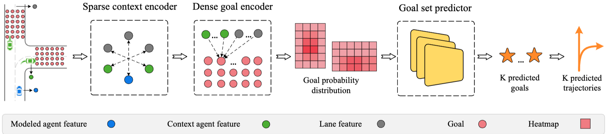
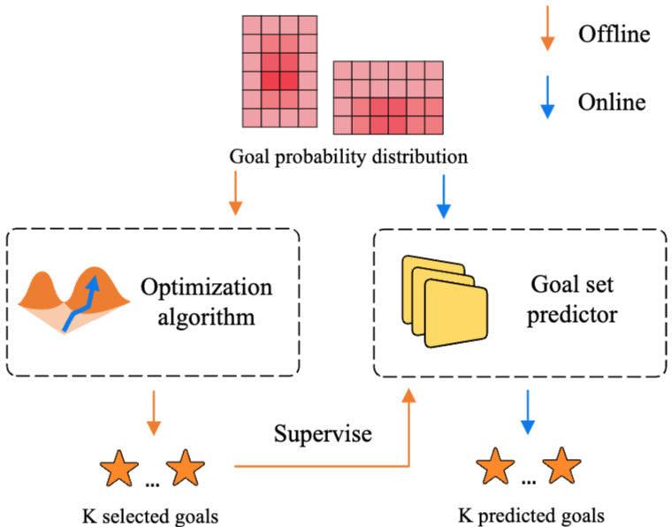

# DenseTNT: End-to-end Trajectory Prediction from Dense Goal Sets
Proceedings of the IEEE/CVF international conference on computer vision. 2021.

## 문제 정의
목표 기반(goal-based) 다중 궤적 예측 방법이 효과적이지만 희소하게 미리 정의된 anchor에 기반한 목표 예측과 휴리스틱한 목표 선택 알고리즘을 사용한다.

## Contribution
- dense goal 후보들을 생성하고 학습 기반 예측기를 통해 목표 세트를 직접 출력하여 휴리스틱 후처리를 피하였다.
- 온라인 goal set predictor를 효과적으로 학습시키기 위해 오프라인 최적화 기반 기법으로 다중 미래 pseudo-labels을 생성한다.

## Method

### Sparse context encoding
scene context, 즉 HD map과 agent들의 특징을 추출하고 상호작용을 파악한다.
본 논문에서는 Vectornet이라는 계증적 그래프 신경망(hierachical graph neural network)을 사용한다. 서브그래프 모듈(subgraph module)은 lane과 agent의 특징을 인코딩하고, 글로벌 그래프 모듈(global graph module)은 attention mechanism을 사용하여 상호작용을 포착한다.
결과로 각 map element 또는 agent의 특징을 나타내는 2D 특징 행렬 $L$를 얻는다.

### Dense goal probability estimation
sparse context 인코딩 결과로부터 map 상의 목표들에 대한 확률 분포를 추정한다. 기존 희소 anchor 방식의 한계를 극복하기 위해 도로 상의 위치들에 대해 밀집된 목표 확률 추정을 수행하여 anchor-free 방식을 구현한다.
목표 확률 추정 전에 lane scoring 모듈을 사용하여 목표가 착지할 가능성이 높은 lane을 예측하여 목표 후보 수를 줄인다.
lane scoring은 binary cross-entropy loss로 학습된다.
dense goal 인코더는 attention mechanism을 사용하여 목표 후보 위치와 lane 간의 로컬 정보를 추출한다. 
목표 특징 행렬 $F$와 map 특징 행렬 $L$로부터 Q,K,V를 계산한다.
$$Q=FW^Q, K=LW^K, V=LW^V$$
attention 결과를 계산하고
$$\displaystyle \mathrm{Attention}(Q,K,V) = \mathrm{softmax} \left( \frac{QK^{T}}{\sqrt{d_k}} \right) V$$
예측된 목표 점수 $\phi_i$는 2계층 MLP $g(\cdot)$를 사용하여 계산한다.
$$\phi_i = \frac{\mathrm{exp}(g(\mathbf{F}_i))}{\sum_{n=1}^{N} \mathrm{exp}(g(\mathbf{F}_n))}$$
binary cross-entropy loss는 예측 목표 점수 $\phi$와 실제 목표 점수 $\psi$ (실제 최종 위치에 가장 가까운 후보는 1, 나머지는 0)간의 오차를 최소화하는데 사용된다.
$$\mathcal{L}_{goal} = \mathcal{L}_{CE}(\phi,\psi)$$

### Goal set prediction

밀집된 확률 추정 결과로 얻은 히트맵을 입력으로 받아 최종 $K$개의 목표 세트를 생성한다. 기존의 NMS와 달리 학습 기반의 goal set predictor를 사용한다. 
자율주행 데이터셋에서 각 시나리오별 하나의 실제 미래 궤적만 관측 가능하다는 supervised learning 문제를 해결하기 위해 오프라인 모델을 사용하여 multi-future 의사 레이블 $\hat y$을 생성한다.
오프라인 모델은 인코딩 결과(히트맵 $h$)를 바탕으로 최적화 알고리즘을 사용하여 의사 레이블 $\hat y$을 생성한다. 이 최적화는 주어진 확률 분포 $h$에 대해 목표 세트 $\hat y$의 예상 오류(expected error)를 최소화하는 $\hat y$을 찾는 것을 목표로 하며, hill climbing 알고리즘으로 구현된다.
$$\mathbb{E}[d(\hat y, Y)] = \sum_{i=1}^{m} h(c_i)d(\hat y, c_i)$$
온라인 goal set predictor는 예측된 목표 세트 $\mathbf{\dot y} = \{\dot y_i\}_{i=1}^K$와 의사 레이블 $\hat y$ 간의 offset을 손실 항으로 사용한다. $\mathcal{L}_{reg}$는 L1 loss이다.
$$\mathcal{L}_{set}(\mathbf{\dot y}, \mathbf{\hat y}) = \sum_{i=1}^K \mathcal{L}_{reg}(\dot y_i, \hat y_i)$$
학습 중에는 예측된 목표 세트 $\dot y$를 최적화 알고리즘의 초기값으로 사용하여 local optimization를 수행하고 이를 통해 얻은 의사 레이블 $\hat y$을 사용하며 $\mathcal{L}_{set}$ 손실을 계산한다.
goal set predictor는 여러 헤드를 가지며, 각 헤드는 $K$개의 목표의 2D 좌표와 해당 헤드의 신뢰도를 예측한다.
헤드 신뢰도 $\mu$는 binary cross-entropy loss로 학습되며, 예상 오류가 가장 낮은 헤드의 신뢰도 레이블 $\nu$은 1, 나머지는 0이다. 추론 시에는 신뢰도가 가장 높은 헤드의 출력을 사용한다.
$$\mathcal{L}_{head} = \mathcal{L}_{CE}(\mu,\nu)$$

### Trajectory completion
예측된 $K$개의 목표 각각에 조건부로 전체 궤적을 완성한다. 각 목표의 특징을 계산한 후에 2계층 MLP 디코더에 통과시켜 전체 궤적 $[\hat s_1, ..., \hat s_T]$를 출력한다. 학습 중에는 실제 목표를 피딩하는 teacher forcing 기법이 사용된다.
손실 항은 예측된 궤적 $\hat s$와 실제 궤적 $s$ 간의 offset입니다. $\mathcal{L}_{reg}$는 smooth L1 loss이다.
$$\mathcal{L}_{completion} = \sum_{t=1}^T \mathcal{L}_{reg}(\hat s_t, s_t)$$

### Learning
학습 절차는 두 단계로 나뉜다. 
첫 번째 단계에서는 목표 세트 예측기를 제외한 모든 모듈을 실제 궤적으로 학습한다.
$$\mathcal{L}_{S1} = \mathcal{L}_{lane}+\mathcal{L}_{goal}+\mathcal{L}_{completion}$$
두 번째 단계에서는 오프라인 모델이 생성한 의사 레이블로 목표 세트 예측기만 학습한다.
$$\mathcal{L}_{S2} = \mathcal{L}_{head}+\mathcal{L}_{set}$$

