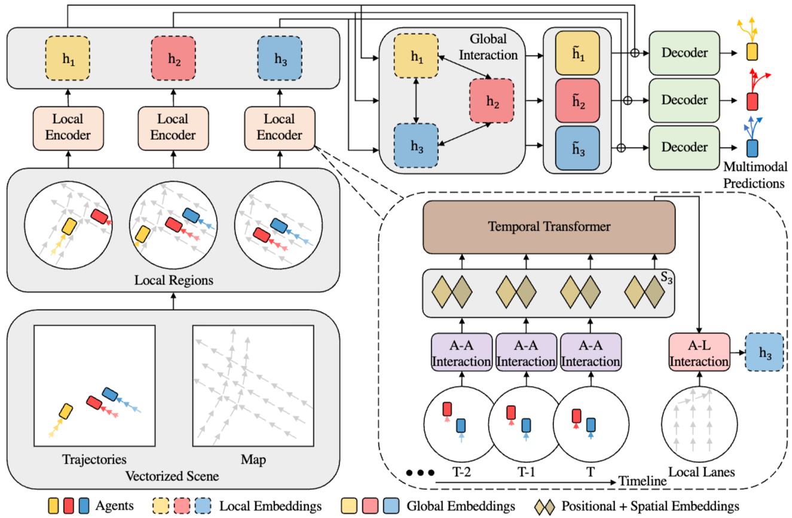

# HiVT: Hierachical Vector Transformer for Multi-Agent Motion Prediction
Proceedings of the IEEE/CVF conference on computer vision and pattern recognition. 2022.

## 문제 정의
최근 벡터화된 접근 방식은 교통 장면의 복잡한 상호 작용을 포착하는 능력으로 인해 모션 예측 분야를 주도하고 있다. 그러나 기존 방법들은 문제의 대칭성(symmetries)을 무시하고 높은 계산 비용을 요구하여, 예측 성능 저하 없이 실시간 multi-agent 모션 예측을 수행하는데 어려움을 겪는다.

## Contribution
- 문제를 local context 추출과 global interaction 모델링으로 분해함으로써, 이 논문의 접근 방식은 다양한 스케일에서 정보를 점진적으로 집계하고 높은 효율성으로 장면 내 많은 수의 개체를 모델링할 수 있다.
- 이 논문의 방법은 translation-invariant scene 표현과 rotation-invariant spatial 학습 모듈을 통해 입력의 변위 및 회전에 강건한 표현을 학습할 수 있다.

## Approach

### Scene Representation
교통 장면의 agent의 궤적 세그먼트와 지도 데이터의 차선 세그먼트와 같은 벡터화된 엔티티의 집합으로 구성된다. 기존 방법들이 절대 위치를 사용하는 것과 달리, HiVT는 엔티티의 기하학적 속성을 상대 위치로 정의하여 장면을 벡터 집합으로 변환한다.
예를 들어 agent $i$의 궤적은 속도 벡터의 시퀀스인 $\{\mathbf{p}_i^t - \mathbf{p}_i^{t-1}\}_{t=1}^T$로 표현되며, agent $j$이 agent $i$에 대한 상대 위치는 $\mathbf{p}_t^j-\mathbf{p}_t^i$로 표현된다. 차선 segment $\xi$의 경우, 그 기하학적 속성은 $\mathbf{p}_\xi^1 - \mathbf{p}_\xi^0$ (시작점0과 끝점1의 차이)로 표현된다.
이러한 표현 방식은 translation invariance를 자연스럽게 보장하며, 엔티티 간의 공간적 관계 정보를 보전한다.

### Hierachical Vector Transformer
직접적인 transformer 적용 시 $O((NT+L)^2)$의 높은 계산복잡도를 가진다. ($N$: agent 수, $T$: 과거 timestep, $L$: 차선 세그먼트 수)
HiVT는 공간 및 시간 차원을 분해하여 효율성을 높인다.
구체적으로, 장면을 각 agent를 중심으로 하는 $N$개의 지역적 영역으로 나눈다. 계산 복잡도는 지역 영역의 반경 제한을 통해 $O(NT^2+TNk+Nl)$로 크게 감소한다. ($k<N, l<L$)

#### Local Encoder
각 지역 영역에 대해 agent-agent 상호작용, 시간적 종속성, agent-lane 상호작용을 순차적으로 모델링하여 지역 정보를 단일 특징 벡터로 집계한다.

**Agent-Agent Interaction**
중심 agent $i$의 최신 궤적 세그먼트 $\mathbf{p}_i^T - \mathbf{p}_i^{T-1}$를 지역 영역의 참조 벡터로 사용하여, 모든 지역 벡터를 이 참조 벡터의 방향 $\theta_i$에 따라 회전시킨다. 회전된 벡터와 관련 의미 속성을 사용하여, MLP ($\phi_{center}, \phi_{nbr}$)를 통해 중심 agent $i$와 주변 agent $j$의 임베딩 $\mathbf{z}_t^i, \mathbf{z}_{ij}^t$를 얻는다.
$$\mathbf{z}_i^t = \phi_{center} \left( \left[ \mathbf{R}_i^\top(\mathbf{p}_i^t - \mathbf{p}_i^{t-1}), \mathbf{a}_i \right] \right)$$
$$\mathbf{z}_{ij}^t = \phi_{nbr} \left( \left[ \mathbf{R}_i^\top(\mathbf{p}_j^t - \mathbf{p}_j^{t-1}), \mathbf{R}_i^\top(\mathbf{p}_j^t - \mathbf{p}_i^t), \mathbf{a}_j \right] \right)$$
여기서 $\mathbf{R}_i$는 $\theta_i$에 의해 매개변화된 회전 행렬이고 $\mathbf{a}$는 semantic attribute이다.

모든 기하학적 속성은 중심 agent를 기준으로 정규화되므로, 이 임베딩들은 전역 좌표계의 회전에 영향을 받지 않는다. 이후에는 중심 agent의 임베딩은 query, 주변 agent의 임베딩은 key/value를 계산하는데 사용된다.
$$\mathbf{q}_i^t = \mathbf{W}^{Q^{space}}\mathbf{z}_i^t, \mathbf{k}_{ij}^t = \mathbf{W}^{K^{space}}\mathbf{z}_{ij}^t, \mathbf{v}_{ij}^t = \mathbf{W}^{V^{space}}\mathbf{z}_{ij}^t$$
$$\displaystyle \alpha_i^t = softmax \left( \frac{\mathbf{q}_i^{t^\top}} {\sqrt{d_k}} \cdot \left[ \{ \mathbf{k}_{ij}^t\}_{j \in \mathcal{N}_i } \right] \right)$$
$$\mathbf{m}_i^t = \sum_{j \in \mathcal{N}_i} \mathbf{\alpha}_{ij}^t\mathbf{v}_{ij}^t$$

gating function을 사용하는 gated fusion 매커니즘을 통해 환경 특징 $m_i^t$와 중심 agent 특징 $\mathbf{z}_i^t$를 융합하여 특징 업데이트를 제어한다.

$$\mathbf{g}_i^t = sigmoid(\mathbf{W}^{gate}\left[\mathbf{z}_i^t, \mathbf{m}_i^t\right]
)$$
$$\mathbf{\hat z}_i^t = \mathbf{g}_i^t \odot \mathbf{W}^{self} \mathbf{z}_i^t + (1-\mathbf{g}_i^t) \odot \mathbf{m}_i^t$$

**Temproal Dependency**
agent-agent 상호작용 모듈에서 반환된 시공간 임베딩 시퀀스 $\{s_i^t\}_{t=1}^T$를 입력으로 사용한다. BERT와 유사하게 추가적인 학습 가능한 토큰을 시퀀스 끝에 추가하고, 위치 임베딩을 적용한다. 이후 Temporal Transformer Encoder를 사용하여 시간적 종속성을 포착하여, 토큰이 이전 timestep에만 주의를 기울이도록 마스크를 적용한다.
$$\mathbf{Q}_i = \mathbf{S}_i\mathbf{W}^{Q^{time}}, \mathbf{K}_i = \mathbf{S}_i\mathbf{W}^{K^{time}}, \mathbf{V}_i = \mathbf{S}_i\mathbf{W}^{V^{time}}$$
$$\displaystyle \mathbf{\hat S}_i = softmax \left( \frac{\mathbf{Q}_i\mathbf{K}_i^{\top}} {\sqrt{d_k}} + \mathbf{M} \right)\mathbf{V}_i$$
$$\mathbf{M}_{uv} =
\begin{cases}
-\infty & \text{if } u<v \\
0 & \text{otherwise}
\end{cases}
$$
여기서 u는 query의 index, v는 key의 index이므로 query보다 key의 index가 큰 경우는 미래를 보는 경우이다.

**Agent-Line Interaction**
현재 timestep $T$에서 지역 차선 세그먼트와 agent-lane 상대 위치 벡터를 회전시킨다. MLP $\phi_{lane}$로 인코딩한 후,
$$\mathbf{z}_{i\xi}=\phi_{lane} \left(\left[\mathbf{R}_i^\top \left(\mathbf{p}_\xi^1 - \mathbf{p}_\xi^0\right), \mathbf{R}_i^\top \left(\mathbf{p}_\xi^0 - \mathbf{p}_i^T\right), \mathbf{a}_\xi \right]\right)$$
중심 agent의 시공간 특징을 query로, 차선의 특징을 key/value로 사용하여 attention를 계산한다.
최종 지역 임베딩 $h_i$를 생성한다.
*수식은 agent-agent와 동일하다.*

### Global Interaction Module
지역 수용 영역의 제한을 보완하고 장면 수준의 동역학을 포착하기 위해 도입되었다. agent-centric 좌표계에서 추출된 지역 특징 간의 프레임 간 기하학적 관계를 연결한다.
agent $i$와 $j$ 간의 페어와이즈 임베딩 $\mathbf{e}_{ij}$는 다음과 같이 계산된다.
$$\mathbf{e}_{ij}=\phi_{lane} \left(\left[\mathbf{R}_i^\top \left(\mathbf{p}_j^T - \mathbf{p}_i^T\right), \cos(\Delta\mathbf{\theta}_{ij}), \sin(\Delta\mathbf{\theta}_{ij})\right]\right)$$
표준 Transformer encoder를 확장하여 이러한 기하학적 관계를 인식하도록 한다.
이 모듈은 $O(N^2)$의 낮은 복잡도를 가지면서 모델의 표현력을 크게 항상시킨다.

### Multimodal Future Decoder
교통 agent의 미래 움직임은 본질적으로 다중 모드이므로, 미래 궤적의 분포를 각 구성 요소가 Laplace distribution인 혼합 모델로 매개변수화한다.
각 agent에 대해 MLP는 지역 및 전역 표현 $(h_i, \tilde h_i)$을 입력으로 받아 각 미래 timestep의 위치 $\mu_{i,f}^t$와 불확실성 $\mathbf{b}_{i,f}^t$를 출력한다.
모든 agent에 대한 예측을 단일 샷으로 수행한다.

### Training
다양한 궤적 가설을 장려하기 위해 variety loss를 사용하여 학습 중에 가장 좋은 $F$개의 예측 중 최적의 하나만 최적화한다.
최종 손실 함수는 회귀 손실 $\mathcal{L}_{reg}$와 분류 손실 $\mathcal{L}_{cls}$로 구성된다.
$$\mathcal{L} = \mathcal{L}_{reg}+\mathcal{L}_{cls}$$

$$\mathcal{L}_{cls} = -\frac{1}{NH} \sum_{i=1}^{N} \sum_{t=T+1}^{T+H} \log P(\mathbf{R}_i^\top(\mathbf{p}_i^t-\mathbf{p}_i^T)|\hat \mu_i^t, \mathbf{\hat b}_i^t)$$
여기서 $\mathcal{L}_{cls}$는 NLL(Negative Log-Likelihood)로 정의되고, $P(\cdot|\cdot)$는 Laplace distribution의 확률밀도함수이다.