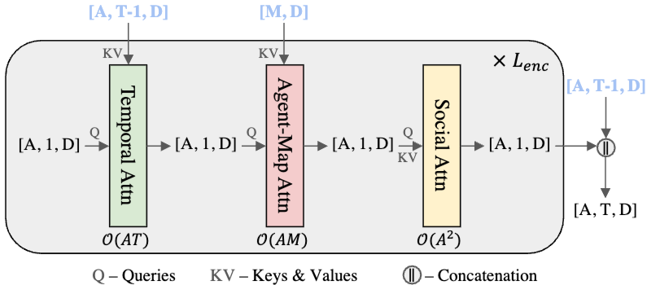
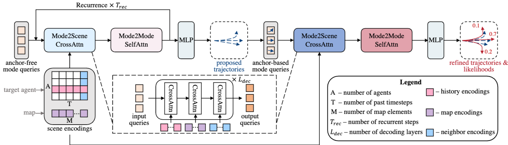

# Query-centric trajectory prediction
Proceedings of the IEEE/CVF conference on computer vision and pattern recognition. 2023

## 기존 연구
최근 궤적 예측에서는 factorized attention-based transformer를 이용해서 많은 발전을 이루었다. 하지만 각 시공간 장면 요소에 대한 attention-based 표현을 학습해야하므로 밀집된 교통장면에서 막대한 비용이 들게 된다. 또한, agent-centric이기 때문에 window slide가 이동할 때마다 재정규화, 재인코딩을 매번 해줘야 하기 떄문에 계산량이 급증한다.

예측 horizon이 길어지게 되면 불확실성이 커지게 된다. 따라서 에이전트의 미래 행동을 포착하기 위해 가장 빈번한 모드가 아닌 내재된 다중 모드 분포를 포착하게 학습한다. 하지만 각 학습 샘플에서는 하나의 가능성만 기록되어 어렵다. 이러한 어려움으로 수작업 anchor를 두었지만 그 anchor의 품질로 인해서 성능이 달라질 수가 있다. 일반적으로 이러한 방법들은 많은 anchor 중에 소수만이 실제값에 가깝게 표현하지 못하면 성능이 크게 떨어진다.

## Contribution
이 논문에서는 장면 인코딩을 위한 query-centric를 도입하여 전역 시공간 좌표계와 독립적인 표현을 학습하여 과거 계산을 재사용하게 한다. 모든 agent 간 불변하는 장면 특징을 공유하여 다중 agent 병렬처리가 가능해진다.
먼저 anchor-free query를 사용하여 순환 방식으로 궤적 제안을 생성한다. 이는 모델이 서로 다른 horizon에서 웨이포인트를 디코딩할 때 다른 장면 맥락을 활용할 수 있게 한다.

## Approach

### Input and Output Formulation
timestep $t$에서 $i$번째 agent의 상태는 위치 $p_{i}^t=(p_{i,x}^t, p_{i,y}^t)$, 각도 $\theta_i^t$ 및 속도 $v_i^t$로 구성된다. 기하학적 속성으로 운동 벡터 $p_i^t - p_i^{t-1}$를 추가한다. 또한, 예측 모듈은 고해상도 지도에서 M개의 다각형(예: 차선 및 횡단보도), 각 샘플링된 점과 semantic 속성이 주석으로 달려있습니다.

지도 정보와 $T$ timestep의 관찰 window 내 agent 상태가 주어지면, 예측 모듈은 각 대상 agent에 대해 $T^\prime$ timestep의 horizon에서 $K$개의 궤적을 예측하고 각 예측에 대한 확률 점수를 활당한다.

### Query-Centric Scene Context Encoding
temporal attention, agent-map attention, social attention의 각각 시간복잡도는 $O(AT^2)$, $O(ATM)$, $O(A^2T)$에 해당되는데 agent나 map element가 많아지게 되면 느려지게 된다.
또한, agent-centric 방법으로 매 frame마다 정규화로 인해 대부분의 frame이 겹침에도 불구하고 장면이 이동할 때마다 재계산을 해야한다.
이러한 문제를 해결하기 위해서 장면 요소의 전역 좌표와 독립적인 표현을 학습하기 위해 query-centric 인코딩 패러다임을 제시한다.
구체적으로 query vector가 유도하는 각 scene element를 위한 로컬 시공간 좌표계를 설정하고, query elememt의 특성을 그들의 로컬 기준 frame에서 처리한다.
그런 다음, attention-based scene 맥락과 혼합할 때는 상대적인 시공간 위치를 key, value로 넣는다.

**Local Spacetime Coordinate System**
timestep $t$에서 $i$번째 agent 상태에 대해서 로컬 좌표계 프레임은 참조 시공간 위치 $(p_i^t, t)$ 및 $\theta_i^t$에 의해서 결정된다.
차선, 횡단보도의 경우 중심선의 진입 지점에서 위치와 방향을 참조로 하여 선택한다.
이와 같은 방식으로 고려된 모든 scene element에 대해 정형적으로 로컬 좌표계를 구축하고, 각 지도 다각형 당 하나의 전용 로컬 프레임 및 각 관찰 window 내의 agent 당 $T$개의 참조 프레임을 생성한다.

**Scene Element Embedding**
각각의 시공간 scene element(agent 상태, 차선)의 모든 기하학적 속성을 극좌표계로 변환하고 fourier feature로 변환하여 고주파 신호에 용이하게 한다.
이 fourier feature는 semantic 속성(agent의 범주)과 concat되어 mlp를 통과해 임베딩을 얻는다.
도로와 횡단보도의 다각형 수준 표현을 추가적으로 생성하기 위해 각 지도 다각형 내 샘플링된 점의 임베딩에 대해 attention-based pooling를 적용한다.
결과적으로 agent 임베딩 형태는 $[A,T,D]$, 지도 임베딩 형태는 $[M,D]$이며 $D$는 hidden feature dim이다.
이러한 임베딩들은 지역 참조 프레임에서의 모델링 덕분에 불변하며, 후속 관찰 window에서 재사용될 수 있다.

**Relative Spatial-Temporal Positional Embedding**
두 scene element $(p_t^i, \theta_t^i, t)$와 $(p_s^j, \theta_s^j, s)$ 사이의 상대적 위치를 요약하기 위해 4D descriptor를 사용한다.
이 descriptor는
상대거리 $||p_s^j-p_t^i||_2$
상대방향 $\arctan2(p^s_{j,y}-p^t_{i,y}, p^s_{j,x}-p^t_{i,x}) - \theta_i^t$
상대각도 $\theta_j^s-\theta_i^t$
상대시간 $s-t$
로 구성된다.

**Self-Attention for Map Encoding**
self-attention을 사용하여 지도 element 간의 관계를 모델링한다. 지도 polygon $i$의 query $m_i$는 이웃 $N_i$의 $m_j$에 attend한다.
key/value는 $[M_j;r_{j\rightarrow i}]$로부터 파생된다.
결과 지도 인코딩 $m_i^\prime$는 전역 시공간 좌표계 변환에 불면하며, 모든 agent 및 timestep에 공유되거나 오프라인에서 사전 계산될 수 있다.

**Factorized Attention for Agent Encoding**

agent $i$의 시점 $t$에서의 상태 $a_t^i$의 query를 사용한다.
- Temporal Attention에서는 agent 자신의 과거 상태에 attend한다.
key/value는 $[a_s^i;r_{i\rightarrow i}^{s\rightarrow t}]$
- Agent-map Attention에서는 지도 인코딩에 attend한다.
key/value는 $[m_j^\prime;r_{j\rightarrow i}]$
- Social Attention은 주변 agent 상태에 attend한다.
key/value는 $[a_t^j;r_{j\rightarrow i}^{t\rightarrow t}]$

이러한 query-centric 모델링 덕분에, 새로운 데이터 프레임이 도착할 때마다 $A$개의 새로운 agent 상태 대해서만 factorized attention를 수행한다.
이는 temporal attention에 $O(AT)$, agent-map attention에 $O(AM)$, social attention에 $O(A^2)$의 복잡도로 효율적이다.

### Query-based Trajectory Decoding

인코더가 생성한 scene 인코딩를 사용하여 각 target agent에 대해 $K$개의 미래 궤적을 디코딩한다.

**Mode2Scene and Mode2Mode Attention**
DETR-like 디코더 아키택처를 사용하며, 각 query는 $K$개의 궤적 모드 중 하나를 담당한다. mode2scene attention에서는 target agent의 history 인코딩, map 인코딩, 이웃 agent 인코딩를 포함한 다양한 context로 mode queries를 업데이트한다.
이후 mode2mode self-attention를 통해 $K$개의 mode queries는 서로 상호작용하여 다양한 모드를 생성한다.

**Reference Frames of Mode Queries**
모든 target agent의 궤적을 병렬로 예측하기 위해, 모든 target agent에 동일한 scdne 인코딩 셋을 공유한다. 각 mode query는 해당 target agent의 현재 위치와 yaw angle를 기반으로 자체적인 좌표계를 가진다.
mode2scene attention을 통해 query 임베딩을 업데이트할 때, scene elements의 query에 대한 상대적 위치 정보가 key/value에 포함된다.

**Anchor-Free Trajectory Proposal**
학습 가능한 anchor-free queries를 사용하여 초기 궤적을 제안한다. 나중에 refinement module에서 anchor로 사용된다.
재귀적 방식으로 작동하여 $T_{rec}$번의 재귀 스텝 동안 각 스텝에서 $T^\prime / T_{rec}$개의 미래 waypoint를 디코딩한다. 이는 queries가 다른 horizon의 waypoint를 예측할 때 다른 scene contexts에 집중하도록 하여 context 추출 부담을 줄이고 anchor의 품질을 향상시킨다.

**Anchor-Based Trajectory Refinement**
proposal module의 출력을 anchor로 사용하며, refinement module은 제안된 궤적에 대한 offset을 예측하고 각 가설의 확률 점수를 추정한다.
이 module 역시 DETR-like 아키텍처를 따르지만, mode queries는 무작위로 초기화되지 않고 제안된 궤적 anchor로부터 파생됩니다. 각 궤적 anchor는 작은 GRU를 통해 임베딩되고, 그 최종 hidden state가 mode query로 사용된다.
이러한 anchor-based queries는 모델에 명시적인 공간 사전 지식(spatial prior)을 제공하여 attention layer가 관심있는 context를 더 쉽게 지역화(localize)하도록 돕는다.

### Training Objective
각 agent의 미래 궤적은 Laplace 분포의 혼잡으로 매개변수화된다.
$$f(\{\mathbf{p}_i^t\}_{t=1}^{T^\prime}) = \sum_{k=1}^{K} \pi_{i,k} \prod_{t=1}^{T^\prime} Laplace(\mathbf{p}_i^t | \mathbf{\mu}_{i,k}^{t}, \mathbf{b}_{i,k}^{t})$$
여기서 $\pi_{i,k}$는 혼합 계수(mixture coefficient)이며, $k$-번째 혼합 성분(mixture component)의 Laplace 밀도는 위치 $\mathbf{\mu}_{i,k}^{t}$와 스케일 $\mathbf{b}_{i,k}^{t}$로 매개변수화된다.
분류 손실 $L_{cls}$는 혼합 계수를 최적화하는데 사용된다. (위치와 스케일에 대한 gradient는 중단)
제안 및 정제 모듈의 위치와 스케일을 최적화하기 위해 winner-take-all 전략을 사용하며, 최상의 예측 제안과 그 정제에 대해서만 역전파를 수행한다.
최종 손실 함수는 궤적 제안 손실 $L_{propose}$, 궤적 정제 손실 $L_{refine}$, 분류 손실 $L_{cls}$를 결합한다.
$$L = L_{propose}+L_{refine}+\lambda L_{cls}$$
여기서 $\lambda$는 회귀와 분류의 균형을 맞추는데 사용된다.