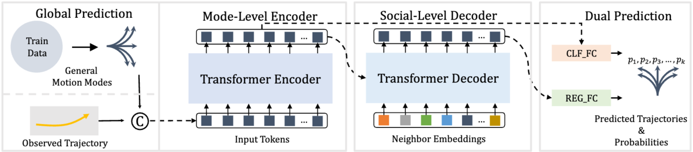

# Trajectory Unified Transformer for Pedestrian Trajectory Prediction
Proceedings of the IEEE/CVF International Conference on Computer Vision. 2023.

## 기존 연구
보행자 trajectory prediction은 관찰된 궤적으로부터 여러 가능한 미래 궤적(multimodal)을 예측하는 문제이며, 기존 방법들은 다양성을 위해 샘플링 후 K-means 같은 post-processing(클러스터링)을 많이 사용한다. 그러나 이 방식은 inference 시간이 길고 각 예측의 확률 정보를 제대로 제공하지 못해 안전 의사결정에 불리하다.

## Contribution
- 보행자 궤적 예측을 통합하기 위해 encoder-decoder transformer 아키텍처를 기반으로 하는 새로운 보행자 궤적 예측 프레임워크 (TUTR)를 제안한다.
- TUTR은 명시적인 글로벌 예측과 암시적인 모드 수준 transformer encoder에 의해 다양한 모션 모드 간의 관계를 분석하여 후처리의 필요성을 효과적으로 제거한다.

## Method

### Problem Definition
보행자와 그 이웃의 궤적을 관찰하여 보행자의 미래 궤적을 예측하는 것을 목표로 한다. 길이 $T$를 갖는 교통 장면의 시퀀스가 $N$명의 보행자를 포함한다고 가정한다.
각 timestep에서 각 보행자에 대해 $N$개의 궤적 좌표 시퀀스 $\{x_t^n, y_t^n\}_{t=1,n=1}^{T,N}$을 추출한다. 궤적 모델은 부분 궤적$\{x_t^n, y_t^n\}_{t=1,n=1}^{T_{obs},N}$의 앞부분을 관찰하고 다음 부분 궤적$\{x_t^n, y_t^n\}_{t=T_{obs}+1,n=1}^{T,N}$을 예측한다.

### Global Prediction
훈련 궤적에 두 개의 rigid transformation을 적용하여 일반적인 동작모드를 얻습니다. 이는 mode-level transformer encoder의 입력 토큰으로 사용된다. 구체적으로, 궤적 가 주어졌을 때, 관측된 부분 궤적를 좌표계 원점으로 평행 이동시키고, 이동된 궤적의 시작점을 X축 양의 방향으로 회전시킨다.
이러한 normalization된 궤적에 대해 클러스터링을 수행하여 $L$개의 중심 $C \in \mathbb{R}^{L \times T_{pred} \times 2}$를 얻는다. 이 중심 $C=\{c_1, ..., c_L\}$는 일반적인 동작 모드를 나타낸다.

### Mode-Level Transformer Encoder
global prediction에서 얻은 일반적인 동작 모드를 기반으로, mode-level transformer encoder는 다양한 동작 모드 간의 관계를 파악한다. global prediction 결과를 linear transformation $\phi$을 통해 embedding하여 $E_c = \phi(C,W_c)$를 얻고, 관측된 궤적 $X\in \mathbb{R}^{B\times T_{obs}\times 2}$를 embedding하여 $E_o = \phi(C,W_o)$를 얻은 후, 이 둘을 더하여 최종 embedding $E_e=E_c+E_o$를 생성한다.
이는 transformer encoder의 입력으로 사용된다. 

### Social-Level Transformer Decoder
social-level transformer decoder는 주변 보행자들과의 social interaction을 추출한다. 주변 보행자들의 관측된 궤적 $X_s \in \mathbb{R}^{N \times T_{obs} \times 2}$를 linear transformation $\phi$을 통해 embedding하여 decoder의 입력 $E_s=\phi(\hat X_s,W_s)$를 얻는다.
이후 encoder-decoder attention 매커니즘을 통해 social interaction을 고려한 출력을 생성한다.

### Dual Prediction
두 개의 예측 헤드 (REG FC, CLF FC)를 사용하여 궤적 회귀(regression) 및 분류 (classification) 작업을 동시에 수행한다. REG FC는 다양한 미래 궤적을 예측하고, CLF FC는 해당 궤적의 확률을 예측한다.
학습 시에는 gt $\hat Y$와 가장 가까운 클러스터링 중심 $c_i$를 찾고, 해당 중심을 gt로 변환하도록 모델을 학습시킨다.
soft 확률 $\hat p$는 다음과 같이 계산된다.
$$p=softmax(\{-||\hat Y - c_i||^2_2 \quad i \in {1,..., L}\})$$

손실 함수는 다음과 같다.
$$\mathcal{L}=\lambda_1 \mathcal{L}_{reg}(Y,\hat Y) + \lambda_2 \mathcal{L}_{clf}(p,\hat p)$$
